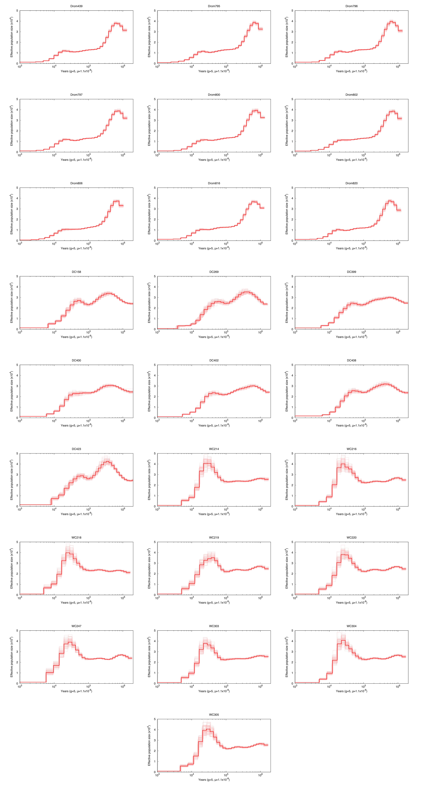

# Demographic Reconstructions using the Pairwise Sequential Markovian Coalescent (PSMC)

_Compress and index the SNP file_
```bash
# Compress using BGzip from the Samtools package
bgzip -c All.SNPs.filtered.vcf > All.SNPs.filtered.vcf.gz

# Index using TABIX from the Samtools package
tabix -p vcf All.SNPs.filtered.vcf.gz
```

_Prepare PSMC Input files then run PSMC (repeat for each individual)_
```bash
# Set ID of one camel (repeat for all)
ID=DC402

# Make a vcf file for the individual; compress and index
zcat All.SNPs.filtered.vcf.gz | \
   vcf-subset -e -c $ID | \
   grep -e "^#" -e "0/1" | \
   bgzip > $ID.vcf.gz
tabix -p vcf $ID.vcf.gz

# Make a fasta file for each individual, masking XY and repetitive regions
# see "Variant Quality Score Recalibration (VQSR) using GATK" for how to make the 'exclude.bed' file
# This fasta file has IUPAC ambiguous base codes for heterozygous SNP loci
cat CB1.fasta | \
   seqtk seq -M exclude.bed -A - | \
   vcf-consensus -i $ID.vcf.gz > $ID.fa

# Convert fasta to psmc fasta format
fq2psmcfa $ID.fa > $ID.psmcfa

# Split for bootstrapping
splitfa $ID.psmcfa > $ID.split.psmcfa

# Run PSMC on the genome
psmc -N25 -t15 -r5 -p "4+25*2+4+6" -o $ID.psmc $ID.psmcfa

# Run PSMC on each bootstrap (n=100 replicates)
for i in {1..100}
   do
   psmc -N25 -t15 -r5 -b -p "4+25*2+4+6" -o $ID.$i.psmc $ID.split.psmcfa
   echo "Finished bootstrap $i"
done
```

_Concatenate bootstrap replicates and build plot_
```bash
# Concatenate bootstrap replicates
cat $ID.psmc $ID.{1..100}.psmc > $ID.bs.psmc
rm -rf $ID.{1..100}.psmc

# Plot with bootstraps
psmc_plot.pl \
   -X2000000 \
   -T $ID \
   -p \
   -R \
   -g5 \
   -Y5 \
   -x1000 \
   -u1.1e-08 \
   $ID.plot \
   $ID.bs.psmc
   
# Remove extra plotting files if not needed
rm -rf $ID.plot.{1..100}.txt \
	$ID.plot.{1..100}.par \
	$ID.plot.eps \
	$ID.plot.gp \
	$ID.plot.par \
	$ID.plot.0.par
mv $ID.plot.0.txt $ID.plot.txt
```

PSMC plots of each individual (not displayed in the manuscript):

  
_Alternatively, build a plot in R (prettier than the standard PSMC plot)_
```R
# Plot in R
pdf("All.camels.psmc.pdf", width = 7, height = 5)
id = read.table("IDs.txt")
id = as.character(id[,1])
col = c(rep("#d40000", 7), rep("#000000", 9), rep("#3771c8", 9))
plot.new()
plot.window(xlim = c(1000, 2000000), ylim = c(0, 5), log= "x")
axis(1, tck= -0.01, at = c(1000, 10000, 100000,1000000), labels = expression(10^3, 10^4, 10^5, 10^6))
axis(1, tck= -0.01, at = c(1000,2000,3000,4000,5000,6000,7000,8000,9000, 10000, 20000, 30000, 40000, 50000, 60000, 70000, 80000, 90000, 100000, 200000, 300000, 400000, 500000, 600000, 700000, 800000, 900000, 1000000), labels = F)
y.axis=seq(0, 5, by = 0.1)
axis(2, las = 1)
axis(2, las = 1, tck = -0.01, at = y.axis, labels = F)
box()
for (i in 1:length(id)){
 	file = paste(id[i], ".plot.txt", sep = "")
	b = read.table(file)
	points(b$V1, b$V2, type = "l", lwd = 2, col = col[i])
}
leg = c(expression(italic("C. dromedarius")), expression(italic("C. bactrianus")), expression(italic("C. ferus")))
legend("topleft", legend = leg, col = c("#000000", "#d40000", "#3771c8"), lty = c(1, 1, 1), bty = "n", lwd =2, cex = 1.2)
mtext(side = 2, expression(paste("Effective Population Size (x", "10"^"4",")")), line = 2.5, cex = 1.25)
mtext(side = 1, "Time (Years ago)", line = 2.5, cex = 1.25)
dev.off()

# Alternatively
pdf("All.camels.psmc.pdf", width = 7, height = 5)
id = read.table("IDs.txt")
id = as.character(id[, 1])
drom2 = id[8:16]
drom2 = sub("Drom", "DROM/Drom", drom2)
drom2 = sub("DROM802", "DROM/DROM802", drom2)
id = c(id, drom2)
col = c(rep("#d40000", 7),rep("#000000", 9), rep("#3771c8", 9), rep("#A9A9A9", 9))
plot.new()
plot.window(xlim = c(1000, 2000000), ylim = c(0, 5), log =         "x")
axis(1, tck= -0.01, at = c(1000, 10000, 100000,1000000), labels = expression(10^3, 10^4, 10^5, 10^6))
axis(1, tck= -0.01, at = c(1000,2000,3000,4000,5000,6000,7000,8000,9000, 10000, 20000, 30000, 40000, 50000, 60000, 70000, 80000, 90000, 100000, 200000, 300000, 400000, 500000, 600000, 700000, 800000, 900000, 1000000), labels = F)
y.axis = seq(0, 5, by = 0.1)
axis(2, las = 1)
axis(2, las = 1, tck = -0.01, at = y.axis, labels = F)
box()
for (i in 1:length(id)){
	file = paste(id[i], ".plot.txt", sep = "")
	b = read.table(file)
	points(b$V1, b$V2, type = "l", lwd = 2, col = col[i])
}
leg = c(expression(italic("C. dromedarius")), expression(italic("C. dromedarius*")),expression(italic("C. bactrianus")), expression(italic("C. ferus")))
legend("topleft", legend = leg, col = c("#000000", "#A9A9A9", "#d40000", "#3771c8"),
   lty = c(1, 1, 1), bty = "n", lwd = 2, cex = 1.2)
mtext(side = 2, expression(paste("Effective Population Size (x", "10"^"4",")")), line = 2.5, cex = 1.25)
mtext(side = 1, "Time (Years ago)", line = 2.5, cex = 1.25)
dev.off()
```
